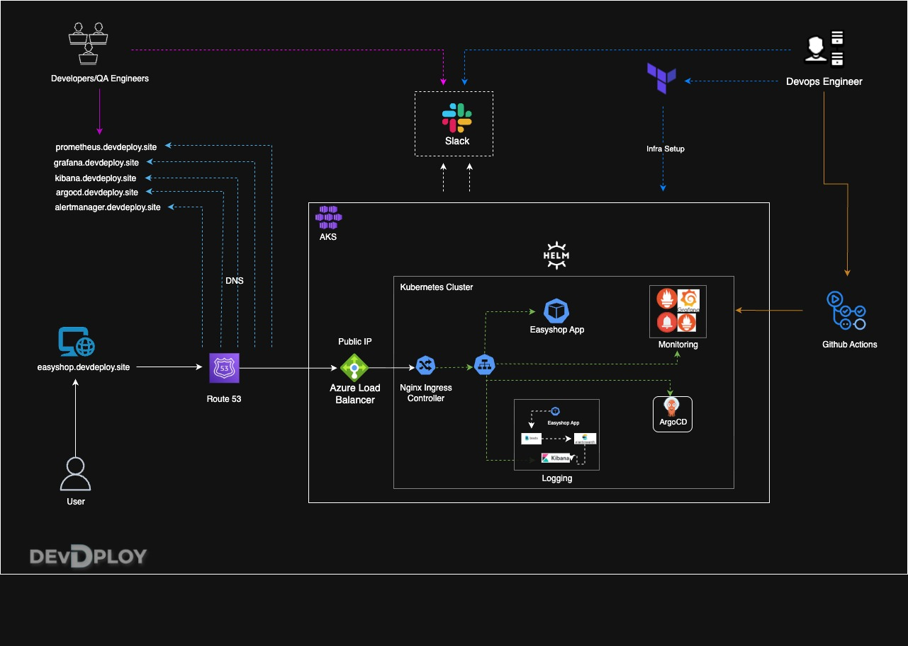
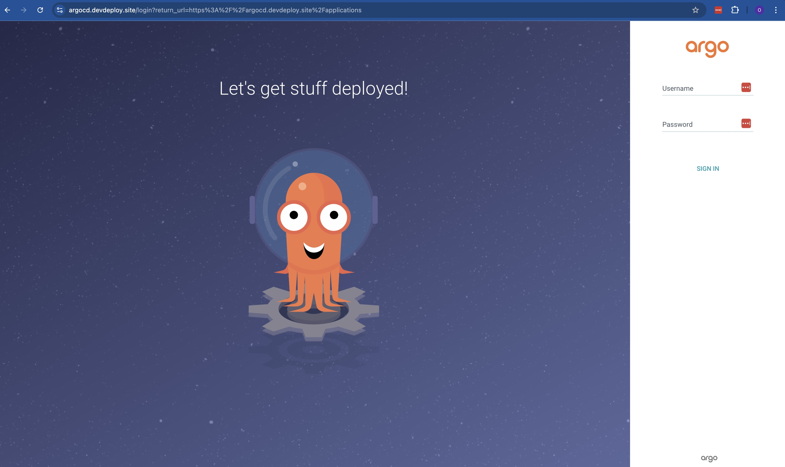
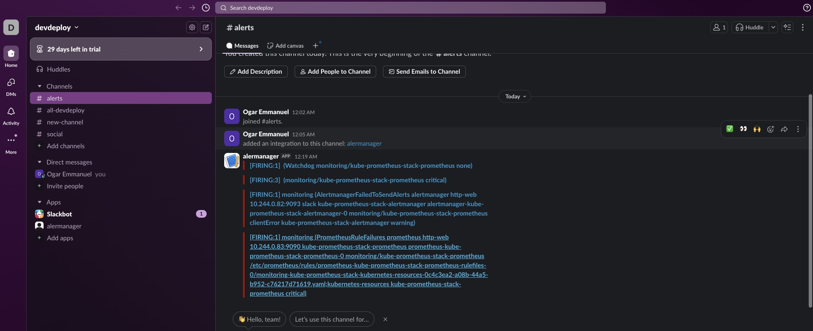
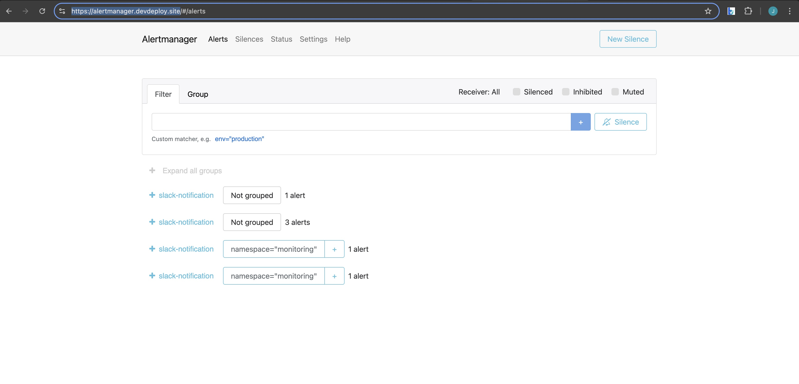
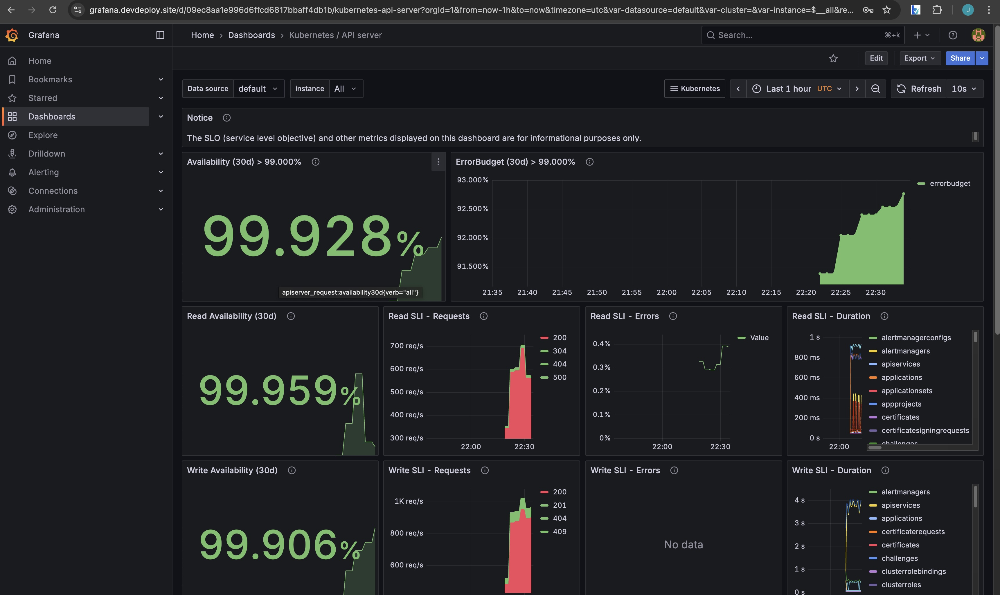
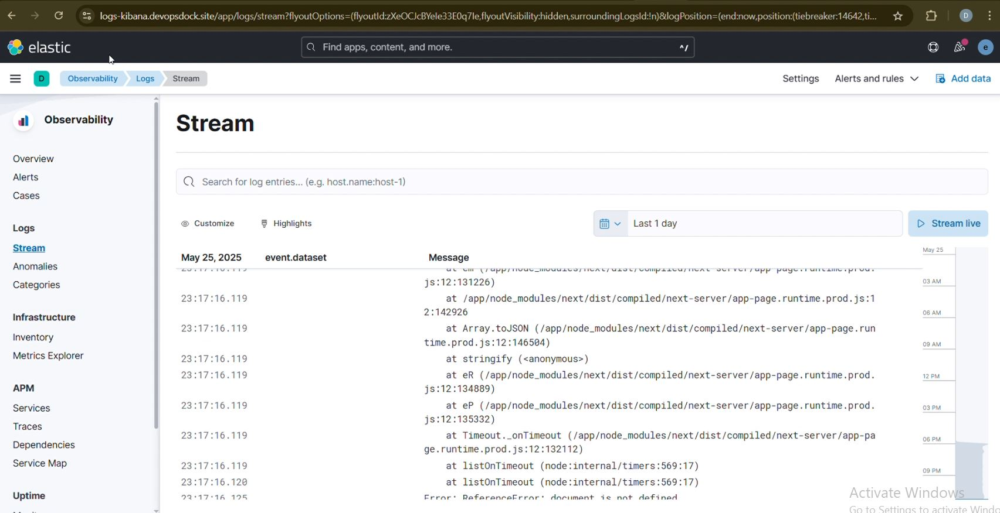
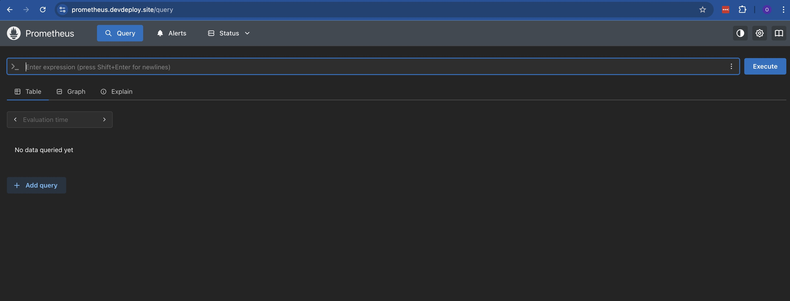

# 🛍️ EasyShop - Modern E-commerce Platform

[](https://nextjs.org/)
[](https://www.typescriptlang.org/)
[](https://www.mongodb.com/)
[](https://redux.js.org/)
[](LICENSE)

EasyShop is a modern, full-stack e-commerce platform built with Next.js 14, TypeScript, and MongoDB. It features a beautiful UI with Tailwind CSS, secure authentication, real-time cart updates, and a seamless shopping experience.

## ✨ Features

- 🎨 Modern and responsive UI with dark mode support
- 🔐 Secure JWT-based authentication
- 🛒 Real-time cart management with Redux
- 📱 Mobile-first design approach
- 🔍 Advanced product search and filtering
- 💳 Secure checkout process
- 📦 Multiple product categories
- 👤 User profiles and order history
- 🌙 Dark/Light theme support

## 🏗️ Architecture

EasyShop follows a three-tier architecture pattern:

### 1. Presentation Tier (Frontend)
- Next.js React Components
- Redux for State Management
- Tailwind CSS for Styling
- Client-side Routing
- Responsive UI Components

### 2. Application Tier (Backend)
- Next.js API Routes
- Business Logic
- Authentication & Authorization
- Request Validation
- Error Handling
- Data Processing

### 3. Data Tier (Database)
- MongoDB Database
- Mongoose ODM
- Data Models
- CRUD Operations
- Data Validation

## PreRequisites

> [!IMPORTANT]  
> Before you begin setting up this project, make sure the following tools are installed and configured properly on your system:

## Setup & Initialization <br/>

### 1. Install [Kubectl](https://kubernetes.io/docs/tasks/tools/#kubectl)
#### Linux
```bash
curl -LO "https://dl.k8s.io/release/$(curl -L -s https://dl.k8s.io/release/stable.txt)/bin/linux/amd64/kubectl"
sudo install -o root -g root -m 0755 kubectl /usr/local/bin/kubectl
kubectl version --client
```
### 2. Install [Helm](https://helm.sh/docs/intro/install/)
#### Linux
```bash
curl -fsSL -o get_helm.sh https://raw.githubusercontent.com/helm/helm/main/scripts/get-helm-3
chmod 700 get_helm.sh
./get_helm.sh
```
### 3. Install Terraform
* Install Terraform<br/>
#### Linux & macOS
```bash
curl -fsSL https://apt.releases.hashicorp.com/gpg | sudo apt-key add -
sudo apt-add-repository "deb [arch=amd64] https://apt.releases.hashicorp.com $(lsb_release -cs) main"
sudo apt-get update && sudo apt-get install terraform
```
### Verify Installation
```bash
terraform -v
```
### Initialize Terraform
```bash
terraform init
```
### 2. Setup Azure CLI
Start by logging into Azure by run the following command and follow the prompts:

```az login --use-device-code```

###  Authentication with Azure CLI
Terraform needs to authenticate with Azure to create and manage resources. Since you are already logged in to the Azure CLI, you can run the following command to set up Terraform authentication:

```export ARM_SUBSCRIPTION_ID=$(az account show --query id -o tsv)```

> [!NOTE] 
> This environment variable will be used by Terraform to determine which Azure subscription to use when creating resources.

## Getting Started

> Follow the steps below to get your infrastructure up and running using Terraform:<br/>

1. **Clone the Repository:**
First, clone this repo to your local machine:<br/>
```bash
git clone https://github.com/emmanuelogar/End-to-End-Complete-CICD-Devops-Project.git
cd terraform/aks
```
2. **Initialize Terraform:**
Initialize the Terraform working directory to download required providers:
```bash
terraform init
```
3. **Review the Execution Plan:**
Before applying changes, always check the execution plan:
```bash
terraform plan
```
4. **Apply the Configuration:**
Now, apply the changes and create the infrastructure:
```bash
terraform apply
```
> Confirm with `yes` when prompted.

8. **Update your kubeconfig:**
Now, let's connect to the AKS cluster using the Azure CLI. You can do this by running the following command to pass Terraform outputs to the Azure CLI command:
```bash
az aks get-credentials \
--resource-group $(terraform output -raw rg_name) \
--name $(terraform output -raw aks_name)
```
9. **Check your cluster:**
```bash
kubectl get nodes
```

### Nginx ingress controller:<br/>
> 1. Install the Nginx Ingress Controller using Helm:
```bash
kubectl create namespace ingress-nginx
```
> 2. Add the Nginx Ingress Controller Helm repository:
```bash
helm repo add ingress-nginx https://kubernetes.github.io/ingress-nginx
helm repo update
```
> 3. Install the Nginx Ingress Controller:
```bash
helm install nginx-ingress ingress-nginx/ingress-nginx \
  --namespace ingress-nginx \
  --set controller.service.type=LoadBalancer
```
> 4. Check the status of the Nginx Ingress Controller:
```bash
kubectl get pods -n ingress-nginx
```
> 5. Get the external IP address of the LoadBalancer service:
```bash
kubectl get svc -n ingress-nginx
```

### Install Cert-Manager

> 1. **Jetpack:** Add the Jetstack Helm repository:
```bash
helm repo add jetstack https://charts.jetstack.io
helm repo update
```
> 2. **Cert-Manager:** Install the Cert-Manager Helm chart:
```bash
helm install cert-manager jetstack/cert-manager \
  --namespace cert-manager \
  --create-namespace \
  --version v1.12.0 \
  --set installCRDs=true
``` 
> 3. **Check pods:**Check the status of the Cert-Manager pods:
```bash
kubectl get pods -n cert-manager
```

> 4. **DNS Setup:** Find your DNS name from the LoadBalancer service:
```bash
kubectl get svc nginx-ingress-ingress-nginx-controller -n ingress-nginx -o jsonpath='{.status.loadBalancer.ingress[0].hostname}'
```
> 5. Create a DNS record for your domain pointing to the LoadBalancer IP.
> - Go to your godaddy dashboard or your prefered Domain name registrar and create a new A record and map the IP you just got in the terminal.

**12. Argo CD Setup**<br/>
Create a Namespace for Argo CD<br/>
```bash
kubectl create namespace argocd
```
1. Install Argo CD using helm  
(https://artifacthub.io/packages/helm/argo/argo-cd)
```bash
helm repo add argo https://argoproj.github.io/argo-helm
helm install my-argo-cd argo/argo-cd --version 8.0.10
```
2. get the values file and save it
```bash
helm show values argo/argo-cd > argocd-values.yaml
```
3. edit the values file, change the below settings.
```
global:
  domain: argocd.domain

configs:
  params:
    server.insecure: true

server:
  ingress:
    enabled: true
    ingressClassName: nginx
    annotations:
      nginx.ingress.kubernetes.io/force-ssl-redirect: "true"
      nginx.ingress.kubernetes.io/backend-protocol: "HTTP"
    extraTls:
      - hosts:
        - argocd.domain
        # Based on the ingress controller used secret might be optional
        secretName: easyshop-tls
```
4. save and upgrade the helm chart.
```
helm upgrade my-argo-cd argo/argo-cd -n argocd -f helm-values-k8s-app/argocd-values.yaml
```
5. add the record in your domain registrar “argocd.domain” with load balancer ip.

6. access it in browser.

7. Retrive the secret for Argocd

```jsx
kubectl -n argocd get secret argocd-initial-admin-secret -o jsonpath="{.data.password}" | base64 -d
```

8. login to argocd “admin” and retrieved password

9. Change the password by going to “user info” tab in the UI.

**Deploy Your Application in Argo CD GUI**

> On the Argo CD homepage, click on the “New App” button.
> 

> Fill in the following details:
> 
> - **Application Name:** `Enter your desired app name`
> - **Project Name:** Select `default` from the dropdown.
> - **Sync Policy:** Choose `Automatic`.

> In the Source section:
> 
> - **Repo URL:** Add the Git repository URL that contains your Kubernetes helm.
> - **Path:** `Kubernetes/helm` (or the actual path inside the repo where your manifests reside)

> In the “Destination” section:
> 
> - **Cluster URL:** [https://kubernetes.default.svc](https://kubernetes.default.svc/) (usually shown as "default")
> - **Namespace:** tws-e-commerce-app (or your desired namespace)

> Click on “Create”.
> 

NOTE: before deploying Chnage your ingress settings and image tag in the yamls inside “kubernetes” directory

Ingress Annotations: 

```jsx
annotations:
    alb.ingress.kubernetes.io/group.name: easyshop-app-lb
    alb.ingress.kubernetes.io/scheme: internet-facing
    alb.ingress.kubernetes.io/certificate-arn: arn:aws:acm:ap-south-1:876997124628:certificate/b69bb6e7-cbd1-490b-b765-27574080f48c
    alb.ingress.kubernetes.io/target-type: ip
    alb.ingress.kubernetes.io/backend-protocol: HTTP
    alb.ingress.kubernetes.io/listen-ports: '[{"HTTP":80}, {"HTTPS":443}]'
    alb.ingress.kubernetes.io/ssl-redirect: '443'
    kubernetes.io/ingress.class: alb
```

- **add record to route 53 “easyshop.devopsdock.site”**

- **Access your site now.**

### Install Metric Server

- metric server install thru helm chart
```
https://artifacthub.io/packages/helm/metrics-server/metrics-server
```
verify metric server.
```
kubectl get pods -w
kubectl top pods
```
### Monitoring Using kube-prometheus-stack

create a namespace “monitoring”

```jsx
kubectl create ns monitoring
```
```
https://artifacthub.io/packages/helm/prometheus-community/kube-prometheus-stack
```
verify deployment :

```jsx
kubectl get pods -n monitoring
```

get the helm values and save it in a file

```jsx
helm show values prometheus-community/kube-prometheus-stack > kube-prom-stack.yaml 
```

edit the file and add the following in the params for prometheus, grafana and alert manger.

**Grafana:**

```jsx
ingressClassName: alb
annotations:
      alb.ingress.kubernetes.io/group.name: easyshop-app-lb
      alb.ingress.kubernetes.io/scheme: internet-facing
      alb.ingress.kubernetes.io/certificate-arn: arn:aws:acm:ap-south-1:876997124628:certificate/b69bb6e7-cbd1-490b-b765-27574080f48c
      alb.ingress.kubernetes.io/target-type: ip
			alb.ingress.kubernetes.io/listen-ports: '[{"HTTP":80}, {"HTTPS":443}]'
      alb.ingress.kubernetes.io/ssl-redirect: '443'
 
    hosts:
      - grafana.devopsdock.site
```

**Prometheus:** 

```jsx
ingressClassName: alb
annotations:
      alb.ingress.kubernetes.io/group.name: easyshop-app-lb
      alb.ingress.kubernetes.io/scheme: internet-facing
      alb.ingress.kubernetes.io/certificate-arn: arn:aws:acm:ap-south-1:876997124628:certificate/b69bb6e7-cbd1-490b-b765-27574080f48c
      alb.ingress.kubernetes.io/target-type: ip
      alb.ingress.kubernetes.io/listen-ports: '[{"HTTP":80}, {"HTTPS":443}]'
      alb.ingress.kubernetes.io/ssl-redirect: '443'
    labels: {}

    
  
    hosts: 
      - prometheus.devopsdock.site
        paths:
        - /
        pathType: Prefix
```
**Alertmanger:**
```jsx
ingressClassName: alb
annotations:
      alb.ingress.kubernetes.io/group.name: easyshop-app-lb
      alb.ingress.kubernetes.io/scheme: internet-facing
      alb.ingress.kubernetes.io/target-type: ip
      alb.ingress.kubernetes.io/backend-protocol: HTTP
			alb.ingress.kubernetes.io/listen-ports: '[{"HTTP":80}, {"HTTPS":443}]'
      alb.ingress.kubernetes.io/ssl-redirect: '443'
    
    hosts: 
      - alertmanager.devopsdock.site
    paths:
    - /
    pathType: Prefix
```

**Alerting to Slack** 

Create a new workspace in slack, create a new channel e.g. “#alerts”

go to https://api.slack.com/apps to create the webhook.

1. create an app “alertmanager”
2. go to incoming webhook
3. create a webhook and copy it.

modify the helm values.

```jsx
config:
    global:
      resolve_timeout: 5m
    route:
      group_by: ['namespace']
      group_wait: 30s
      group_interval: 5m
      repeat_interval: 12h
      receiver: 'slack-notification'
      routes:
      - receiver: 'slack-notification'
        matchers:
          - severity = "critical"
    receivers:
    - name: 'slack-notification'
      slack_configs:
          - api_url: 'https://hooks.slack.com/services/T08ULBZB5UY/B08U0CE3DEG/OivCLYq28gNzz4TabiY5zUj'
            channel: '#alerts'
            send_resolved: true
    templates:
    - '/etc/alertmanager/config/*.tmpl'
```

Note: you can refer this DOCs for the slack configuration. “https://prometheus.io/docs/alerting/latest/configuration/#slack_config” 

upgrade the chart

```jsx
helm upgrade my-kube-prometheus-stack prometheus-community/kube-prometheus-stack -f kube-prom-stack.yaml -n monitoring
```

get grafana secret “user = admin”

```jsx
kubectl --namespace monitoring get secrets my-kube-prometheus-stack-grafana -o jsonpath="{.data.admin-password}" | base64 -d ; echo
```

You would get the notification in the slack’s respective channel.

## **Logging**
- we will use elasticsearch for logsstore, filebeat for log shipping and kibana for the visualization. 
```
NOTE: The EBS driver we installed is for elasticsearch to dynamically provision an EBS volume.
```
**Install Elastic Search:**

```jsx
helm repo add elastic https://helm.elastic.co -n logging
helm install my-elasticsearch elastic/elasticsearch --version 8.5.1 -n logging
```

Create a storageclass so that elastic search can dynamically provision volume in AWS.

storageclass.yaml

```jsx
apiVersion: storage.k8s.io/v1
kind: StorageClass
metadata:
  name: ebs-aws
  annotations:
    storageclass.kubernetes.io/is-default-class: "true"
provisioner: ebs.csi.aws.com
reclaimPolicy: Delete
volumeBindingMode: WaitForFirstConsumer
```

apply the yaml file.

get the values for elastic search helm chart.

```jsx
helm show values elastic/elasticsearch > elasticsearch.yaml 
```

update the values

```jsx
replicas: 1
minimumMasterNodes: 1
clusterHealthCheckParams: "wait_for_status=yellow&timeout=1s"
```

upgrade the chart

```jsx
helm upgrade my-elasticsearch elastic/elasticsearch -f elasticsearch.yaml -n logging
```

if upgarde doesnt happen then uninstall and install it again.

make sure the pod is running .

```jsx
kubectl get po -n logging
NAME                     READY   STATUS    RESTARTS   AGE
elastic-operator-0       1/1     Running   0          6h33m
elasticsearch-master-0   1/1     Running   0          87m
```

**FileBeat:**

install filebeat for log shipping.

```jsx
helm repo add elastic https://helm.elastic.co
helm install my-filebeat elastic/filebeat --version 8.5.1 -n logging
```

get the values

```jsx
helm show values elastic/filebeat > filebeat.yaml 
```

Filebeat runs as a daemonset. check if its up.

```jsx
kubectl get po -n logging
NAME                         READY   STATUS    RESTARTS   AGE
elastic-operator-0           1/1     Running   0          6h38m
elasticsearch-master-0       1/1     Running   0          93m
my-filebeat-filebeat-g79qs   1/1     Running   0          25s
my-filebeat-filebeat-kh8mj   1/1     Running   0          25s
```

**Install Kibana:**

install kibana through helm.

```jsx
helm repo add elastic https://helm.elastic.co
helm install my-kibana elastic/kibana --version 8.5.1 -n logging
```

Verify if it runs.

```jsx
k get po -n logging
NAME                               READY   STATUS    RESTARTS       AGE
elastic-operator-0                 1/1     Running   0              8h
elasticsearch-master-0             1/1     Running   0              3h50m
my-filebeat-filebeat-g79qs         1/1     Running   0              138m
my-filebeat-filebeat-jz42x         1/1     Running   0              108m
my-filebeat-filebeat-kh8mj         1/1     Running   1 (137m ago)   138m
my-kibana-kibana-559f75574-9s4xk   1/1     Running   0              130m
```

get values

```jsx
helm show values elastic/kibana > kibana.yaml 
```

modify the values for ingress settings

```jsx
ingress:
  enabled: true
  className: "alb"
  pathtype: Prefix
  annotations:
    alb.ingress.kubernetes.io/group.name: easyshop-app-lb
    alb.ingress.kubernetes.io/scheme: internet-facing
    alb.ingress.kubernetes.io/target-type: ip
    alb.ingress.kubernetes.io/backend-protocol: HTTP
    alb.ingress.kubernetes.io/certificate-arn: arn:aws:acm:ap-south-1:876997124628:certificate/b69bb6e7-cbd1-490b-b765-27574080f48c
    alb.ingress.kubernetes.io/listen-ports: '[{"HTTP":80}, {"HTTPS":443}]'
    alb.ingress.kubernetes.io/ssl-redirect: '443'
  # kubernetes.io/ingress.class: nginx
  # kubernetes.io/tls-acme: "true"
  hosts:
    - host: logs-kibana.devopsdock.site
      paths:
        - path: /
```

save the file and exit. upgrade the helm chart using the values file.

```jsx
helm upgrade my-kibana elastic/kibana -f kibana.yaml -n logging
```

add all the records to route 53 and give the value as load balancer DNS name. and try to access one by one. 

retrive the secret of elastic search as kibana’s password, username is “elastic”

```jsx
kubectl get secrets --namespace=logging elasticsearch-master-credentials -ojsonpath='{.data.password}' | base64 -d
```

### **Filebeat Configuration to ship the "easyshop" app logs to elasticsearch**

configure filebeat to ship the application logs to view in kibana

```jsx
filebeatConfig:
    filebeat.yml: |
      filebeat.inputs:
      - type: container
        paths:
          - /var/log/containers/*easyshop*.log
```

upgrade filebeat helm chart and check in kibana’s UI if the app logs are streaming.

## **Congratulations!** <br/>


---

### 📌 Architecture Diagram


---

### 📌 ArgoCD


---

### 📌 Capture


---

### 📌 AlertManager



---

### 📌 Grafana Dashboard


---

### 📌 Kibana Logs View


---

### 📌 Prometheus Dashboard


### WO! ooo!!! ...Your project is now deployed.
